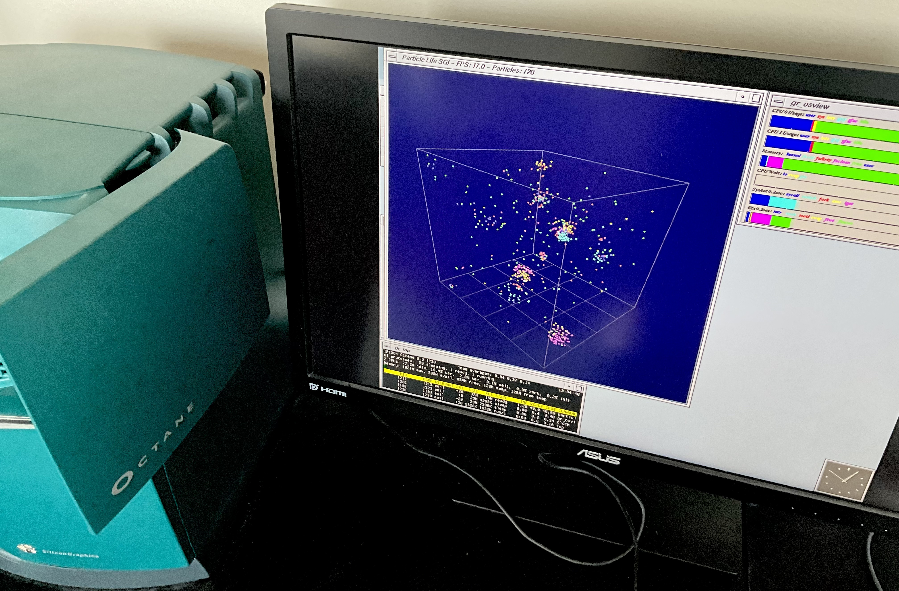

# Particle Simulation Demo

This is a Silicon Graphics IRIX 6.5 OpenGL 1.1 graphical demo. The project is an experiment with basic physics and rendering in a fun way. It has no commercial purpose and is released openly for anyone to use, modify, or build upon.

## License

This project is licensed under the MIT License. See the licens of the original project as of 20250622 file for details.

## Acknowledgements

This project is inspired by the [Particle Life project by @hunar4321](https://github.com/hunar4321/particle-life).

Some aspects of the physics simulation were refined using ideas and example code from that project. The final implementation was assisted by GitHub Copilot and may contain similarities in parameter values or behavior, but uses a different approach and was written independently in C.

## Disclaimer

This README was written with the help of ChatGPT.
